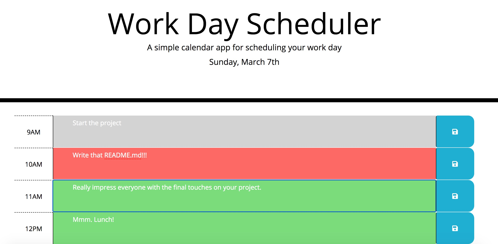

# Work Day Scheduler

## Description 

Everybody's got a million things to do all at once. If only we had a way to help us keep trak of our day on our computers
as we get through task afer task. We've heard the need, and we have brought you the Work Day Scheduler!

Just go ahead and load it up and give it a try! Go ahead and type in your tasks throughout your workday and hit the blue save button.

If your task is due presently, your block will turn red to let you know you've got to get to it! Your future tasks are green, you've got some time.

The application is deployed at 
(https://clayto30.github.io/work-day-scheduler/).

## Table of Contents (Optional)

* [Installation](#installation)
* [Usage](#usage)
* [Credits](#credits)
* [License](#license)

## Installation

Go ahead and visit the site! This will help you organize your time today. You'll see that today's date is already displayed,
so we all know what you're working with!

## Usage 

As you are assigned tasks throughout your work day, be sure to add them to the hour, and click the blue save button.
Keep an eye on this site throughout your day, for a quick reminder of just what needs to get done.

Here is what I've been doing today:

## Credits

UCB Extension Coding Bootcamp designed this challenge for me to demonstrate what I have learned using 3rd party API's like Bootstrap and
jQuery. The Coding Bootcamp provided the mockup, starter code, and the funtionality that I tried to accomplish. 

My TA, Mason McGinley, provided assistance.

## License

Permission is hereby granted, free of charge, to any person obtaining a copy
of this software and associated documentation files (the "Software"), to deal
in the Software without restriction, including without limitation the rights
to use, copy, modify, merge, publish, distribute, sublicense, and/or sell
copies of the Software, and to permit persons to whom the Software is
furnished to do so, subject to the following conditions:

The above copyright notice and this permission notice shall be included in all
copies or substantial portions of the Software.

THE SOFTWARE IS PROVIDED "AS IS", WITHOUT WARRANTY OF ANY KIND, EXPRESS OR
IMPLIED, INCLUDING BUT NOT LIMITED TO THE WARRANTIES OF MERCHANTABILITY,
FITNESS FOR A PARTICULAR PURPOSE AND NONINFRINGEMENT. IN NO EVENT SHALL THE
AUTHORS OR COPYRIGHT HOLDERS BE LIABLE FOR ANY CLAIM, DAMAGES OR OTHER
LIABILITY, WHETHER IN AN ACTION OF CONTRACT, TORT OR OTHERWISE, ARISING FROM,
OUT OF OR IN CONNECTION WITH THE SOFTWARE OR THE USE OR OTHER DEALINGS IN THE
SOFTWARE.

---

© 2021 Clayton Goff.
